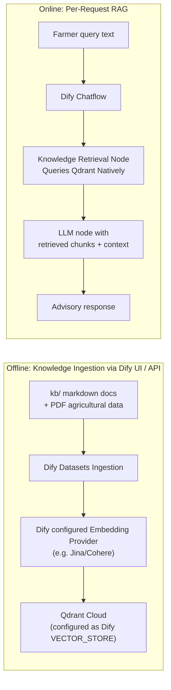
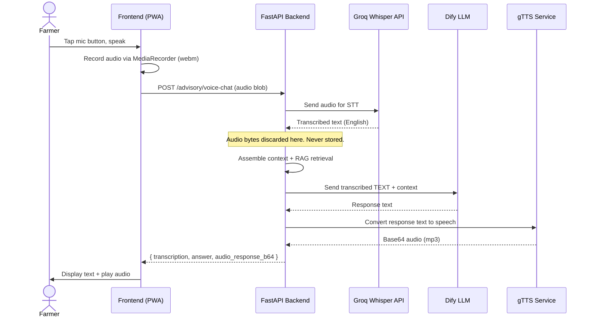
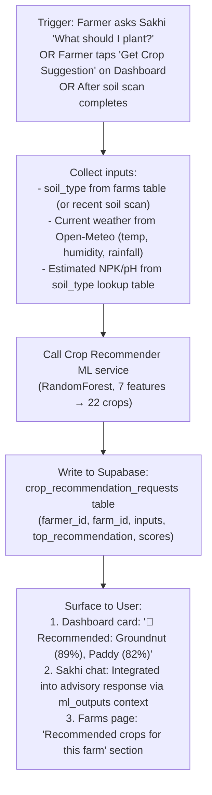
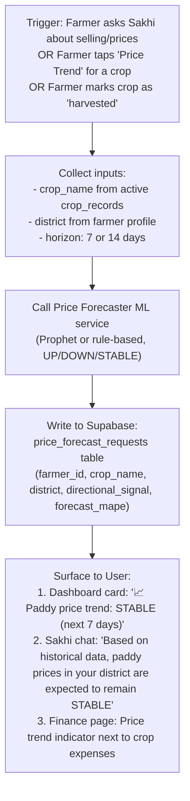

# Krishi Sakhi — Master Implementation Plan v2.1
> Last updated: 2026-04-19
> Status: Module-based task system active. Backend scaffold live. Dify workflow partially built (KB Retrieval + IF/ELSE + S3 upload). ML stubs present. Camera mocked.
> This document is the **definitive task checklist**. Agents MUST follow tasks in order and check them off.

---

## Current State Audit (Ground Truth)

Before any task, understand what actually exists:

| Component | State | Details |
|---|---|---|
| **Frontend (React+Vite)** | ✅ Live | Auth, Dashboard, Chat, Farms, Crops, Activity, Finance, Camera, Profile screens |
| **Backend (FastAPI)** | ✅ Scaffold | Routers: farms, crops, expenses, activity, advisory, ml_scans, auth, weather |
| **Advisory Pipeline** | ✅ Working | Frontend → FastAPI → Dify Chat API → Response + gTTS audio |
| **STT** | ✅ Working | Groq whisper-large-v3-turbo via `elevenlabs_stt.py` (misnamed, uses Groq). Audio captured in frontend, transcribed in backend, sent as text to Dify. |
| **TTS** | ✅ Working | gTTS (Google Text-to-Speech) returning Base64 audio. Response text from Dify converted to voice in backend before returning to frontend. |
| **Camera Screen** | ⚠️ Mocked | File input exists, calls `/api/v1/scans/pest`, but shows static image + "Camera Disabled for Demo" |
| **ML Services** | ✅ Verified | All 4 services (`soil_classifier`, `crop_recommender`, `price_forecaster`, `transcriber`) are fully rebuilt natively against trained models and datasets. They record execution logs attached to the authenticating `farmer_id` against Supabase. |
| **Dify Chatflow** | ⚠️ Partial | Workflow partially built: START → IF/ELSE (image check) → HTTP Request (S3 upload) → Knowledge Retrieval (Qdrant + Dify built-in reranking) → LLM (`Llama-3.1-8b-instant` via Groq) → Answer. Needs: conversation variables, IF/ELSE condition setup, vision model for image path. See `dify/DIFY_WORKFLOW_GUIDE.md`. |
| **Knowledge Base** | ⚠️ Partial | 6 KB markdown docs in `kb/` being ingested into Dify's native Dataset. Dify handles chunking, embedding, and reranking internally. Knowledge Retrieval node exists in workflow. Verify all 6 files are uploaded to the Dify dataset. |
| **VDB** | ⚠️ Partial | Qdrant Cloud configured in `.env`. Used as Dify's native vector store (`VECTOR_STORE=qdrant`). Knowledge Retrieval node queries Qdrant with Dify's built-in reranking. |
| **DB Schema** | ⚠️ Partial | `schema.md` is authoritative, but only migrations 019 and 021 exist in `supabase/migrations/` |
| **Weather** | ✅ Working | Open-Meteo integration via `weather_client.py`, but Dashboard still shows hardcoded `32°/75%/2mm` |
| **Audit Writer** | ⚠️ Stub | `audit_writer.py` exists but is a placeholder (does not write to DB) |
| **CORS** | ⚠️ Open | `allow_origins=["*"]` in production — must fix |
| **Secrets** | ⚠️ Exposed | `.env` contains all API keys. Service role key present. Not rotated |

**Tech stack for RAG pipeline (finalized):**
- **LLM (Dify primary):** Groq free tier (`Llama-3.1-8b-instant`) for text queries — fast, free, reliable
- **LLM (Image analysis):** OpenRouter free tier (`google/gemini-2.5-flash-image-preview:free`) — vision-capable, needed for crop/soil image analysis
- **LLM (Backend fallback):** Groq `llama-3.1-8b-instant` called directly if Dify fails entirely
- **Embeddings:** Dify-managed embedding provider (configured in Dify Dataset settings) — NO custom Python embedding scripts
- **Reranking:** Dify's built-in reranking system — configured natively in the Knowledge Retrieval node, no external API key needed
- **Vector DB:** Qdrant Cloud (free tier cluster in `.env`) — used as Dify's native `VECTOR_STORE`
- **Orchestration:** Dify Community Edition — handles RAG natively (Knowledge Retrieval node → Qdrant), image S3 upload via HTTP Request node, LLM generation
- **Data Ingestion:** Upload KB docs via Dify UI Dataset manager (NOT n8n, NOT custom Python ingestion scripts)

---

## Task Structure

```
Module A  Dify Workflow Design & Qdrant RAG Pipeline       (Tasks A.1–A.10)
Module B  Chat Intelligence & Tool-Calling                 (Tasks B.1–B.12)
Module C  Audio STT/TTS Hardening                          (Tasks C.1–C.8)
Module D  Camera Module & ML Pipeline                      (Tasks D.1–D.8)
Module E  ML Full Implementation & Supabase Enrichment     (Tasks E.1–E.14)
Module F  Multi-Language Support (DEPRIORITIZED)            (Tasks F.1–F.8)
Module G  Security & Bug Fixes                             (Tasks G.1–G.12)
Module H  System Hardening & Future Readiness              (Tasks H.1–H.10)
```

---

# Module A — Dify Workflow Completion & Qdrant Native RAG

**Purpose:** Complete the partially-built Dify chatflow into a production-grade RAG advisory pipeline. The workflow foundation already exists (IF/ELSE, HTTP Request for S3 upload, Knowledge Retrieval with Cohere rerank, LLM, Answer). Remaining work: add input variables for context injection, complete IF/ELSE conditions, ingest all 6 KB files, and configure vision-capable model for the image analysis path. Uses **Qdrant** as native vector store via Dify's built-in retrieval. No local models (Ollama), no FAISS, no n8n.

## Why This Architecture



**Why Dify Native Qdrant:**
- Dify supports Qdrant out of the box by setting `VECTOR_STORE=qdrant` in its environment configuration.
- We avoid building and maintaining a custom Python retrieval API and ingestion script.
- Dify's dataset management UI can be used for chunking, embedding, and syncing documents directly to Qdrant Cloud.
- Qdrant Cloud gives us persistent storage, metadata filtering, and scalability.

**Why NOT n8n:**
- n8n adds operational complexity (another Docker service to maintain).
- The data ingestion is a one-time or infrequent operation — Dify's built-in dataset UI is sufficient.

## Current State (Dify Workflow — Partially Built)

- **Chatflow:** Partially built in Dify UI — has START, IF/ELSE (image check), HTTP Request (S3 upload w/ retry), Knowledge Retrieval (Dify built-in reranking), LLM (`Llama-3.1-8b-instant`), Answer nodes
- **YAML export:** `dify/chatflow - krishi sakhi.yml` — outdated, reflects earlier state. Live chatflow in Dify UI is ahead of this file
- **Knowledge Base docs:** `kb/` has 6 markdown files — content being ingested into Dify Dataset for RAG
- **Data Ingestion:** `Krishi Sakshi Data Ingestion.json` (n8n workflow) — **will be deleted**
- **VDB:** Qdrant Cloud configured as Dify's native vector store. Credentials in `.env`: `QDRANT_URL` and `QDRANT_API_KEY`
- **Detailed guide:** See `dify/DIFY_WORKFLOW_GUIDE.md` (artifact) for step-by-step node configuration

## Tasks

### A.1 — Document the New Dify Architecture
- [ ] Create `dify/DIFY_ARCHITECTURE.md` documenting:
  - The new node graph leveraging Dify's native Knowledge Retrieval node
  - LLM models: Groq `Llama-3.1-8b-instant` (text primary) + OpenRouter `google/gemini-2.5-flash-image-preview:free` (vision/image analysis)
  - RAG strategy: Dify Knowledge Retrieval Node → Qdrant
  - Conversation variables for context injection
  - Safety guardrails in system prompt
  - Configuration instructions for Dify `.env` (VECTOR_STORE=qdrant)

### A.2 — Configure Dify for Qdrant and Ingest Knowledge
- [ ] Update Dify deployment `.env` (where Dify is hosted) to use Qdrant:
  ```
  VECTOR_STORE=qdrant
  QDRANT_URL=https://...cloud.qdrant.io
  QDRANT_API_KEY=...
  ```
- [ ] Restart Dify services to apply vector store changes.
- [ ] In Dify UI, create a new Dataset "Krishi Knowledge".
- [ ] Upload the 6 markdown files from `kb/` folder into the Dify Dataset.
- [ ] Configure Dify Dataset to use High Quality Indexing (Semantic).

### A.3 — Complete the Dify Chatflow Configuration
- [ ] **The chatflow already has 6 nodes** — complete their configuration:
  ```
  ┌────────────────────┐
  │  START              │ Input vars: farmer_name, farmer_district,
  │  (User Input)       │ farm_details, active_crops, weather_summary,
  │                     │ ml_outputs, recent_expenses. Files: optional
  └──┬──────────┬───────┘
     │          │
     │     ┌────▼──────────────┐
     │     │ KNOWLEDGE         │ All 6 KB files in dataset
     │     │ RETRIEVAL         │ Qdrant-backed, Dify built-in reranking
     │     └────┬──────────────┘
     │          │
  ┌──▼────────┐ │
  │ IF/ELSE   │ │  Condition: sys.files contains image type
  └─┬────┬────┘ │
    │    │      │
  ┌─▼──┐ │     │
  │HTTP│ │     │  Upload to Supabase S3 (retry 3x)
  │REQ │ │     │
  └─┬──┘ │     │
  ┌─▼────▼─────▼──┐
  │     LLM       │  Gemini (vision) or Llama (text)
  │               │  System prompt + context + KB chunks
  └───────┬───────┘
  ┌───────▼───────┐
  │    ANSWER     │  Returns {{#llm.text#}}
  └───────────────┘
  ```
- [ ] Fix `img_inp` variable in START — change to optional or remove (images arrive via `sys.files`)
- [ ] Complete IF/ELSE condition: `sys.files` contains item where `type` IN `[image]`
- [ ] See `dify/DIFY_WORKFLOW_GUIDE.md` for detailed node-by-node configuration

### A.4 — Add Conversation Variables for Context Injection
- [ ] In the chatflow, add conversation variables (farmer_name, farm_details, weather_summary, etc.) and map them in the LLM System Prompt.
- [ ] Export updated chatflow YAML to `dify/chatflow - krishi sakhi v2.yml`

### A.5 — Update Dify Client to Send Context
- [ ] Modify `backend/services/dify_client.py` to pass context variables via Dify API inputs. (No need to pass retrieved_knowledge since Dify handles retrieval).
- [ ] Update `backend/routers/advisory.py` to only assemble context and call Dify.

### A.6 — Add LLM Fallback Chain
- [ ] Handle fallback in `backend/services/dify_client.py` for Dify timeouts/failures by directly calling Groq API.

### A.7 — Delete n8n Artifacts
- [ ] Delete `Krishi Sakshi Data Ingestion.json` from project root
- [ ] Remove any n8n references from docs

### A.8 — Clean Up Legacy Dify/KB Config
- [ ] Archive the old chatflow
- [ ] Remove unused placeholders from config files.

### A.9 — Verification: Dify + RAG Module Complete
- [ ] Dify chatflow has all 6 nodes properly connected: START, IF/ELSE, HTTP Request (S3), Knowledge Retrieval, LLM, Answer
- [ ] All 6 KB markdown files ingested into Dify Dataset "Krishi Knowledge"
- [ ] Qdrant Cloud connected (`VECTOR_STORE=qdrant` in Dify `.env`)
- [ ] Knowledge Retrieval returns relevant chunks for test queries
- [ ] Input variables pass from FastAPI → Dify API `inputs` → LLM system prompt
- [ ] Image upload path works: image → IF/ELSE → S3 upload → LLM vision analysis
- [ ] LLM fallback triggers correctly when Dify fails (backend calls Groq directly)
- [ ] Safety guardrails verified (test: ask for pesticide dosage → should refuse)
- [ ] `dify/DIFY_WORKFLOW_GUIDE.md` referenced and reviewed
- [ ] No n8n artifacts remain in the project
- [ ] No FAISS or Ollama references in code or docs

---

# Module B — Chat Intelligence & Tool-Calling

**Purpose:** Make the chat assistant intelligent enough to extract structured data from natural conversation and automatically populate farm records, crop details, expenses, and activity logs—eliminating manual data entry.

## Scope & Deliverables

| Deliverable | Description |
|---|---|
| Intent detection | Backend classifies farmer messages to detect actionable intents |
| Entity extraction | Extract farm names, crop names, dates, amounts from natural language |
| Auto-population | Chat conversation automatically creates/updates farms, crops, expenses, activities in Supabase |
| Confirmation UX | Before writing to DB, show the farmer what will be saved and ask for confirmation |
| Suggestion cards | After data extraction, show action buttons: "Save this crop record?" / "Log this expense?" |

## Tasks

### B.1 — Define Intent Taxonomy
- [ ] Create `backend/services/intent_classifier.py` with these intent categories:
  ```python
  INTENTS = {
      "add_crop": "Farmer mentions planting/sowing a new crop",
      "add_expense": "Farmer mentions spending money on farming",
      "log_activity": "Farmer describes a farming activity they performed",
      "update_growth_stage": "Farmer mentions growth stage change",
      "report_harvest": "Farmer reports completing harvest",
      "report_yield": "Farmer mentions yield/sale data",
      "ask_advice": "General advisory question (default)",
      "update_farm": "Farmer mentions farm details (soil, irrigation)",
  }
  ```

### B.2 — Implement LLM Intent + Entity Extraction
- [ ] Create `backend/services/entity_extractor.py`:
  ```python
  async def extract_intent_and_entities(farmer_text: str, farmer_context: dict) -> dict:
      """
      Uses Groq LLM to classify intent and extract structured entities.
      Returns: {
          "intent": "add_crop",
          "confidence": 0.92,
          "entities": {
              "crop_name": "paddy",
              "farm_name": "North Plot",
              "sowing_date": "2026-04-15",
              "season": "kharif"
          },
          "requires_confirmation": true
      }
      """
  ```
- [ ] Use Groq `llama-3.1-8b-instant` for fast, cheap classification (NOT the advisory LLM)
- [ ] Prompt must include farmer's existing farm names and crop names for entity resolution
- [ ] Return `requires_confirmation: true` for any write-intent, `false` for read-only

### B.3 — Create Tool Execution Service
- [ ] Create `backend/services/tool_executor.py`:
  ```python
  TOOLS = {
      "add_crop": execute_add_crop,
      "add_expense": execute_add_expense,
      "log_activity": execute_log_activity,
      "update_growth_stage": execute_update_growth_stage,
      "report_harvest": execute_report_harvest,
      "report_yield": execute_report_yield,
      "update_farm": execute_update_farm,
  }
  
  async def execute_tool(intent: str, entities: dict, farmer_id: UUID, db: Client) -> dict:
      """Executes the tool and returns the result for the LLM to communicate."""
  ```
- [ ] Each tool function performs the Supabase write and returns a structured result
- [ ] All tools validate entities before writing (e.g., crop_name must exist in `ref_crops`)
- [ ] All tools use the farmer's JWT-scoped client (not service role) to respect RLS

### B.4 — Wire Intent Detection into Advisory Pipeline
- [ ] Modify `backend/routers/advisory.py` `/ask` endpoint:
  ```
  1. Receive farmer message
  2. Assemble context (existing)
  3. Run intent + entity extraction (NEW - parallel with step 4)
  4. Retrieve knowledge from Qdrant + send to Dify (existing, updated in Module A)
  5. If intent detected with requires_confirmation:
     - Append confirmation prompt to response
     - Store pending_action in session state
  6. Return response + suggested_actions
  ```
- [ ] Add `suggested_actions` field to `AdvisoryAskResponse` model:
  ```python
  class SuggestedAction(BaseModel):
      action_type: str  # e.g., "add_crop"
      display_text: str  # e.g., "Save paddy crop to North Plot?"
      entities: dict  # Pre-extracted entities
  
  class AdvisoryAskResponse(BaseModel):
      response_text: str
      audio_b64: str = ""
      suggested_actions: list[SuggestedAction] = []
      # ... existing fields
  ```

### B.5 — Create Tool Confirmation Endpoint
- [ ] Add `POST /api/v1/advisory/confirm-action`:
  ```python
  @router.post("/advisory/confirm-action")
  async def confirm_action(
      action_type: str,
      entities: dict,
      farmer_id: UUID = Depends(get_current_farmer_id),
      db: Client = Depends(get_supabase)
  ):
      result = await execute_tool(action_type, entities, farmer_id, db)
      return {"status": "success", "result": result}
  ```
- [ ] Endpoint validates the action and entities
- [ ] Returns the created/updated record details

### B.6 — Frontend: Render Suggested Actions
- [ ] In `AIAssistantChatScreen.jsx`, modify the AI message bubble to render action cards:
  ```jsx
  {msg.suggested_actions?.length > 0 && (
      <div className="mt-3 space-y-2">
          {msg.suggested_actions.map((action, idx) => (
              <button key={idx}
                  onClick={() => handleConfirmAction(action)}
                  className="w-full text-left p-3 bg-emerald-50 border border-emerald-200 
                             rounded-xl text-sm font-medium text-emerald-800
                             hover:bg-emerald-100 transition-colors flex items-center gap-2">
                  <CheckCircle2 className="w-4 h-4 flex-shrink-0" />
                  {action.display_text}
              </button>
          ))}
      </div>
  )}
  ```
- [ ] `handleConfirmAction` calls `/api/v1/advisory/confirm-action`
- [ ] Show success toast: "✅ Paddy crop record saved to North Plot!"
- [ ] Show failure toast with reason if validation fails

### B.7 — Add Tool Calling to backendClient.js
- [ ] Add `confirmAction` function to `frontend/src/lib/backendClient.js`:
  ```javascript
  export async function confirmAction({ actionType, entities, token }) {
      const resp = await fetch(`${API_BASE}/api/v1/advisory/confirm-action`, {
          method: 'POST',
          headers: {
              'Content-Type': 'application/json',
              'Authorization': `Bearer ${token}`,
          },
          body: JSON.stringify({ action_type: actionType, entities }),
      })
      if (!resp.ok) throw new Error(`Action confirm error ${resp.status}`)
      return resp.json()
  }
  ```

### B.8 — Entity Resolution Against Existing Data
- [ ] `entity_extractor.py` must resolve ambiguous entity references:
  - "my first farm" → look up farmer's farms, pick the first by `created_at`
  - "the paddy crop" → match against active `crop_records` for this farmer
  - "Rs 5000 for fertilizer" → extract `amount_inr=5000, category=fertilizer`
  - "I planted tomato on April 10" → `crop_name=tomato, sowing_date=2026-04-10`
- [ ] Include farmer's existing data in the LLM extraction prompt for disambiguation

### B.9 — Session State for Multi-Turn Confirmation
- [ ] If the farmer says "yes" or "save it" after a suggested action, execute the pending tool
- [ ] Store `pending_actions` per session in-memory (dict keyed by session_id)
- [ ] Clear pending actions after execution or after 3 turns without confirmation

### B.10 — Handle Unknown / Mixed Intents
- [ ] If intent confidence < 0.6, treat as pure advisory (no tool suggestion)
- [ ] If multiple intents detected, prioritize the strongest and note others:
  ```json
  { "intent": "add_expense", "secondary_intents": ["log_activity"] }
  ```
- [ ] Never auto-execute tools — always require farmer confirmation

### B.11 — Test Tool-Calling End-to-End
- [ ] Test: "I spent 2000 rupees on pesticide for my paddy" → should suggest adding expense
- [ ] Test: "I planted groundnut on my river field last week" → should suggest adding crop record
- [ ] Test: "The paddy is now flowering" → should suggest updating growth stage
- [ ] Test: "What's the best fertilizer for paddy?" → pure advisory, no tool suggestion
- [ ] Test: "I harvested 500 kg of paddy and sold at 25 rupees per kg" → should suggest yield record

### B.12 — Verification: Chat Intelligence Complete
- [ ] Intent classification works for all 8 intent types
- [ ] Entity extraction handles Indian farming vocabulary
- [ ] Confirmation cards render in chat UI
- [ ] Confirmed actions write correct data to Supabase
- [ ] No auto-writes without farmer confirmation
- [ ] Advisory still works normally for pure questions
- [ ] `advisory_messages.context_block_sent` includes extracted intents

---

# Module C — Audio STT/TTS Hardening

**Purpose:** Harden the existing STT/TTS pipeline. English only (regional languages deprioritized to Module F). 

## Actual Audio Flow (Corrected)



**Key point:** Audio capture happens in the frontend. The audio is sent to the backend, where it is:
1. **Transcribed (STT)** by Groq Whisper → text
2. **Text sent to Dify** for advisory processing
3. **Response text converted (TTS)** by gTTS → audio
4. Everything returned to frontend

## Current State

| Component | Implementation | Issues |
|---|---|---|
| STT | `services/elevenlabs_stt.py` — Groq `whisper-large-v3-turbo` | Misnamed file. No fallback. Returns empty string on failure. English only is fine for now. |
| TTS | `services/elevenlabs_tts.py` — gTTS library | Misnamed file. No quality check. Large responses slow to encode. English only is fine for now. |
| Voice Hook | `hooks/useVoiceRecorder.js` — `audio/webm` | Works. No compression. No max-duration limit. |
| Voice Chat | `/api/v1/advisory/voice-chat` | Endpoint works. No retry logic. |

## Tasks

### C.1 — Rename STT/TTS Service Files (Accuracy)
- [ ] Rename `backend/services/elevenlabs_stt.py` → `backend/services/stt_service.py`
- [ ] Rename `backend/services/elevenlabs_tts.py` → `backend/services/tts_service.py`
- [ ] Update all imports in `backend/routers/advisory.py`
- [ ] Update `backend/services/__init__.py`

### C.2 — STT Fallback Chain (English Only)
- [ ] Implement tiered STT fallback in `stt_service.py`:
  ```python
  async def transcribe_audio(audio_file: UploadFile) -> dict:
      """
      Returns: {"text": str, "provider": str}
      Fallback order:
        1. Groq whisper-large-v3-turbo (cloud, fast, free tier) — English
        2. Return structured error asking farmer to type instead
      """
  ```
- [ ] Tier 1 (Groq): Keep existing implementation, add timeout (10s), hardcode `language="en"`
- [ ] Tier 2 (Graceful failure): Return a structured error response, not empty string:
  ```python
  return {"text": "", "provider": "none", "error": "Could not transcribe. Please try typing your question."}
  ```
- [ ] Client-side fallback (Web Speech API) is optional/future — do NOT implement now

### C.3 — TTS Hardening (English Only)
- [ ] Harden TTS in `tts_service.py`:
  ```python
  async def generate_speech(text: str) -> dict:
      """
      Returns: {"audio_b64": str, "provider": str}
      Uses gTTS with English (Indian accent).
      Fallback: return empty audio_b64 (text-only response).
      """
  ```
- [ ] Hardcode gTTS to `lang='en', tld='co.in'` (Indian English) — no language parameter for now
- [ ] Truncate text to 5000 characters before TTS (gTTS limit handling)
- [ ] Add timeout protection: if gTTS takes >8 seconds, return empty audio
- [ ] Frontend fallback: if no `audio_b64` in response, use browser `SpeechSynthesis`:
  ```javascript
  // In AIAssistantChatScreen.jsx, add a "🔊" speaker button on AI messages:
  const handlePlayTTS = (text) => {
      if ('speechSynthesis' in window) {
          const utterance = new SpeechSynthesisUtterance(text);
          utterance.lang = 'en-IN';
          speechSynthesis.speak(utterance);
      }
  };
  ```

### C.4 — Audio Input Quality Guards
- [ ] Add max recording duration (60 seconds) to `useVoiceRecorder.js`:
  ```javascript
  const MAX_DURATION_MS = 60000;
  // Auto-stop after 60 seconds
  const timerRef = useRef(null);
  // In startRecording:
  timerRef.current = setTimeout(() => stopRecording(), MAX_DURATION_MS);
  // In stopRecording: clearTimeout(timerRef.current);
  ```
- [ ] Add minimum recording duration (500ms) — ignore recordings shorter than this
- [ ] Validate file size before upload: reject >10MB audio blobs

### C.5 — Retry Logic for Voice Chat
- [ ] In `frontend/src/lib/backendClient.js`, add retry for `sendVoiceMessage`:
  ```javascript
  export async function sendVoiceMessage({ audioBlob, farmerId, conversationId, token, retries = 2 }) {
      for (let attempt = 0; attempt <= retries; attempt++) {
          try {
              // ... existing fetch logic
              return await resp.json();
          } catch (err) {
              if (attempt === retries) throw err;
              await new Promise(r => setTimeout(r, 1000 * (attempt + 1)));
          }
      }
  }
  ```

### C.6 — Voice Indicator UX Polish
- [ ] Add recording duration display: "Recording... 0:05" in chat input area
- [ ] Add waveform/amplitude visualizer during recording (use `AnalyserNode` from Web Audio API)
- [ ] Show "Processing voice..." spinner between recording stop and transcription return
- [ ] If transcription returns empty, show: "I couldn't catch that. Could you repeat or try typing?"

### C.7 — Ensure Voice-Chat Endpoint Uses Full RAG Pipeline
- [ ] The existing `/advisory/voice-chat` endpoint must be updated to use the new RAG pipeline:
  ```python
  @router.post("/voice-chat")
  async def voice_chat_endpoint(audio, farmer_id, db):
      # 1. Transcribe audio (STT)
      transcription = await transcribe_audio(audio)
      
      # 2. Assemble context
      context = await assemble_context(farmer_uuid, None, None, db)
      
      # 3. Retrieve knowledge from Qdrant (NEW — same as text path)
      retrieved_knowledge = await retrieve_knowledge(transcription, ...)
      
      # 4. Send to Dify with context + knowledge
      dify_response = await ask_dify_with_fallback(transcription, context, retrieved_knowledge)
      
      # 5. Generate TTS
      audio_b64 = await generate_speech(dify_response["answer"])
      
      # 6. Return
      return { "transcription": ..., "answer": ..., "audio_response_b64": ... }
  ```

### C.8 — Verification: Audio Module Complete
- [ ] STT works via Groq cloud on first attempt (English)
- [ ] If Groq fails (simulate by clearing API key), graceful error message shown
- [ ] TTS generates audio for responses under 5000 characters (English)
- [ ] Max recording duration enforced (60s auto-stop)
- [ ] Service files renamed correctly, no import errors
- [ ] Voice chat retry logic works on simulated network failure
- [ ] Voice chat uses the Qdrant RAG pipeline (not bypassing retrieval)
- [ ] Speaker button fallback works when gTTS fails

---

# Module D — Camera Module & ML Pipeline

**Purpose:** Transform the currently mocked camera screen into a functional capture → classify → store → feedback pipeline.

## Current State

- `CropDiseaseDetectionCamera.jsx`: Has file input and API call to `/api/v1/scans/pest`, but:
  - Shows a static Unsplash image placeholder instead of camera feed/preview
  - Camera button says "Camera Disabled for Demo"
  - Sends `farm_id: 'dummy-farm-id'`
  - No scan type selection
  - No image compression
- `backend/routers/ml_scans.py`: Has `/scans/soil` and `/scans/pest` endpoints
  - Returns hardcoded `"Alluvial"` / `"Early Blight"` — no ML model called
  - Does upload to Supabase Storage correctly
  - Column names don't match schema

## Corrected UX Flow

```
User taps "Scan Crop" on Dashboard
         │
         ▼
┌───────────────────────┐
│  Choose capture method │
│ ┌─────────┐ ┌────────┐│
│ │📷 Take  │ │📁 From ││
│ │  Photo  │ │Gallery ││
│ └─────────┘ └────────┘│
└────────────┬──────────┘
             │
             ▼
    Image preview shown
             │
             ▼
┌───────────────────────┐
│  What do you want to  │
│  scan?                │
│ ┌─────────┐ ┌────────┐│
│ │🌱 Soil  │ │🐛 Plant││
│ │  Scan   │ │  Scan  ││
│ └─────────┘ └────────┘│
└────────────┬──────────┘
             │
             ▼
    Select Farm (dropdown)
    + Crop (if Plant Scan)
             │
             ▼
    Upload → ML Model → Result Card
```

## Tasks

### D.1 — Fix Camera Screen: Capture Method Selection
- [ ] Remove the static Unsplash image and "Camera Disabled for Demo" text
- [ ] Show two primary action buttons on the main camera screen:
  ```jsx
  <div className="flex gap-4">
      <button onClick={handleCameraCapture}>
          📷 Take Photo
      </button>
      <button onClick={handleGalleryPick}>
          📁 From Gallery
      </button>
  </div>
  ```
- [ ] For "Take Photo": Use `<input type="file" accept="image/*" capture="environment" />`
- [ ] For "From Gallery": Use `<input type="file" accept="image/*" />` (no capture attribute)
- [ ] After image selected/captured, show a preview using `URL.createObjectURL`
- [ ] Add a "Retake / Choose Another" button below the preview

### D.2 — Add Scan Type Selection (After Image Capture)
- [ ] After image is captured/selected, show scan type choice:
  ```jsx
  {imagePreviewUrl && !scanType && (
      <div className="flex gap-4 mt-4">
          <button onClick={() => setScanType('soil')}
              className="flex-1 p-4 bg-amber-50 border-2 border-amber-200 rounded-xl text-center">
              🌱 Soil Scan
          </button>
          <button onClick={() => setScanType('pest')}
              className="flex-1 p-4 bg-red-50 border-2 border-red-200 rounded-xl text-center">
              🐛 Plant / Disease Scan
          </button>
      </div>
  )}
  ```
- [ ] Scan type selection determines which backend endpoint is called (`/scans/soil` or `/scans/pest`)

### D.3 — Add Farm/Crop Selector (After Scan Type)
- [ ] After scan type is selected, show farm dropdown:
  ```jsx
  {scanType && (
      <select value={selectedFarmId} onChange={...}>
          <option value="">Select your farm...</option>
          {farms.map(f => <option key={f.id} value={f.id}>{f.farm_name}</option>)}
      </select>
  )}
  ```
- [ ] If scan type is "pest": also show crop dropdown (active crops for selected farm)
- [ ] Fetch farms from Supabase on component mount
- [ ] Disable "Analyze" button until farm is selected
- [ ] Pass real `farm_id` and `crop_record_id` to backend

### D.4 — Client-Side Image Compression
- [ ] Before upload, compress image using Canvas API:
  ```javascript
  function compressImage(file, maxWidth = 1200, quality = 0.8) {
      return new Promise((resolve) => {
          const img = new Image();
          img.onload = () => {
              const canvas = document.createElement('canvas');
              const ratio = Math.min(maxWidth / img.width, 1);
              canvas.width = img.width * ratio;
              canvas.height = img.height * ratio;
              const ctx = canvas.getContext('2d');
              ctx.drawImage(img, 0, 0, canvas.width, canvas.height);
              canvas.toBlob(resolve, 'image/jpeg', quality);
          };
          img.src = URL.createObjectURL(file);
      });
  }
  ```
- [ ] Max upload size: 2MB after compression

### D.5 — Fix Backend ml_scans.py Column Names
- [ ] Fix `scan_soil` endpoint:
  - Change `"image_path"` → `"storage_path"` (match schema)
- [ ] Fix `scan_pest` endpoint:
  - Change `"image_path"` → `"storage_path"`
  - Change `"predicted_disease"` → `"predicted_pest_or_disease"`
  - Add `"growth_stage_at_scan"` field (snapshot from crop_records)
  - Remove `"treatment_recommendation"` (not in schema)
- [ ] Add proper error handling: if Supabase Storage upload fails, return 500 with details

### D.6 — Wire ML Microservices to Backend
- [ ] Modify `scan_soil` to call the soil_classifier microservice:
  ```python
  async def call_soil_classifier(image_bytes, farm_id, farmer_id):
      async with httpx.AsyncClient(timeout=settings.ml_timeout_seconds) as client:
          files = {"image": ("soil.jpg", image_bytes, "image/jpeg")}
          data = {"farm_id": str(farm_id), "farmer_id": str(farmer_id)}
          resp = await client.post(f"{settings.soil_classifier_url}/classify", files=files, data=data)
          return resp.json()
  ```
- [ ] If ML microservice is unreachable, return a stub response with `mode: "stub"` flag
- [ ] Same pattern for pest scan calling a pest_classifier microservice

### D.7 — Show Scan Results with Advisory Integration
- [ ] After scan result, show result card:
  ```
  ┌─────────────────────────────────┐
  │ 🔍 Soil Analysis Result         │
  │                                 │
  │ Type: Black Soil                │
  │ Confidence: 94%                 │
  │ Farm: North Plot                │
  │                                 │
  │ [Ask Sakhi About This] [Done]   │
  └─────────────────────────────────┘
  ```
- [ ] "Ask Sakhi About This" navigates to `/assistant` with the scan result pre-loaded as context
- [ ] Pass scan result via URL params or app state

### D.8 — Verification: Camera Module Complete
- [ ] Camera capture option opens device camera
- [ ] Gallery picker opens file selection
- [ ] Scan type selection (Soil/Plant) appears after image capture
- [ ] Farm selector populates with farmer's actual farms
- [ ] Crop selector appears for pest scans only
- [ ] Image compresses to <2MB before upload
- [ ] Image uploads to Supabase Storage in correct path
- [ ] ML microservice is called (or stub response with flag)
- [ ] Scan result displays correctly
- [ ] `soil_scans` or `pest_scans` row written to DB with correct column names
- [ ] "Ask Sakhi" button works from scan result

---

# Module E — ML Full Implementation & Supabase Data Enrichment

**Purpose:** Replace all ML stubs with real model implementations. Clearly define how each ML model integrates with the user-facing product and where outputs surface.

## How Each ML Model Benefits the User

### Crop Recommender — "What should I plant next?"



**Where it updates Supabase:** `crop_recommendation_requests` table
**Where it shows for the user:**
1. **Dashboard** — "Recommended Crops" card (top-3 with confidence)
2. **Chat** — When farmer asks "what to plant", Sakhi's response incorporates the ML recommendation via `ml_outputs` context variable
3. **Farm detail view** — "Suggestions for this farm" based on soil type + weather

### Price Forecaster — "Should I sell now or wait?"



**Where it updates Supabase:** `price_forecast_requests` table
**Where it shows for the user:**
1. **Dashboard** — "Market Signal" card (UP ↑ / DOWN ↓ / STABLE →)
2. **Chat** — Sakhi incorporates the signal when discussing selling crops
3. **Finance Tracker** — Price trend indicator next to each crop's expense summary
4. **CRITICAL:** Never show exact prices. Only directional signal with disclaimer.

## Required Data, Formats, and Models

| ML Service | Input | Output | Model | Data Source |
|---|---|---|---|---|
| Soil Classifier | JPEG image (1200px max) | `{ predicted_soil_class, confidence_score }` | YOLOv8n-cls | Trained on soil surface dataset |
| Crop Recommender | `{ N, P, K, pH, temperature, humidity, rainfall }` (7 floats) | `{ top_recommendation, recommendation_scores: [{crop, score}...] }` | RandomForest | Crop Recommendation Dataset (Kaggle) |
| Price Forecaster | `{ crop_name, district, horizon_days }` | `{ directional_signal: UP/DOWN/STABLE, forecast_mape }` | Prophet | data.gov.in mandi prices |
| Transcriber | Audio blob (webm) | `{ text, confidence }` | Whisper base | N/A (pretrained) |

## Tasks

### E.1 — Soil Classifier: Real Model Integration
- [ ] Obtain or train YOLOv8n classification model on soil dataset:
  - Classes: clay, loam, sandy, red, black, alluvial
  - Training: see Ultralytics docs for `yolo classify train`
  - Store weights: `ml/soil_classifier/model/soil_yolov8n.pt`
- [ ] Update `ml/soil_classifier/main.py`:
  ```python
  from ultralytics import YOLO
  from PIL import Image
  import io
  
  model = YOLO("model/soil_yolov8n.pt")
  
  @app.post("/classify")
  async def classify(image: UploadFile = File(...), ...):
      img_bytes = await image.read()
      img = Image.open(io.BytesIO(img_bytes)).convert("RGB")
      results = model(img)
      top_class = results[0].probs.top1
      confidence = float(results[0].probs.top1conf)
      return { "predicted_soil_class": CLASSES[top_class], "confidence_score": round(confidence, 4), ... }
  ```
- [ ] Update `requirements.txt`: add `ultralytics`, `Pillow`, `torch`
- [ ] Create `ml/soil_classifier/Dockerfile`
- [ ] **If model weights unavailable:** Keep stub but add `mode: "stub"` to response

### E.2 — Crop Recommender: Real Model Integration
- [ ] Download Crop Recommendation Dataset (Kaggle: `atharvaingle/crop-recommendation-dataset`)
- [ ] Train RandomForest:
  ```python
  from sklearn.ensemble import RandomForestClassifier
  import joblib
  # Train on N, P, K, temperature, humidity, ph, rainfall → 22 crop classes
  joblib.dump(model, "model/crop_rf.pkl")
  ```
- [ ] Update `ml/crop_recommender/main.py`:
  ```python
  import joblib
  model = joblib.load("model/crop_rf.pkl")
  
  @app.post("/recommend")
  async def recommend(data: CropInput):
      features = [[data.nitrogen, data.phosphorus, data.potassium,
                    data.temperature, data.humidity, data.ph, data.rainfall]]
      probas = model.predict_proba(features)[0]
      top_indices = probas.argsort()[-5:][::-1]
      return {
          "top_recommendation": model.classes_[top_indices[0]],
          "recommendation_scores": [
              {"crop_name": model.classes_[i], "confidence_score": round(float(probas[i]), 4)}
              for i in top_indices
          ]
      }
  ```
- [ ] Store weights: `ml/crop_recommender/model/crop_rf.pkl`

### E.3 — Price Forecaster: Real or Simulated
- [ ] **If real:** Use Prophet with mandi price data from data.gov.in:
  - Fetch historical price data for major crops (paddy, groundnut, tomato) in TN/AP districts
  - Pre-train Prophet models per crop-district pair
  - Store as `.pkl` files in `ml/price_forecaster/models/`
- [ ] **If simulated (recommended for prototype):** Use a simple rule-based directional signal:
  ```python
  @app.post("/forecast")
  async def forecast(data: ForecastInput):
      import datetime
      month = datetime.date.today().month
      if data.crop_name.lower() in ["paddy", "rice"]:
          signal = "UP" if month in [10, 11, 12] else "STABLE"
      else:
          signal = "STABLE"
      return { "directional_signal": signal, "forecast_mape": 0.10, "horizon_days": data.horizon_days }
  ```
- [ ] **CRITICAL:** Never return exact price predictions. Only UP/DOWN/STABLE.

### E.4 — Backend: Crop Recommendation Endpoint
- [ ] Create `POST /api/v1/recommendations/crop` in a new router `backend/routers/recommendations.py`:
  ```python
  @router.post("/recommendations/crop")
  async def get_crop_recommendation(
      farm_id: str,
      farmer_id: UUID = Depends(get_current_farmer_id),
      db: Client = Depends(get_supabase)
  ):
      # 1. Get farm details (soil_type)
      farm = db.table("farms").select("soil_type").eq("id", farm_id).single().execute()
      soil = farm.data.get("soil_type", "loam")
      
      # 2. Get weather data for farmer's district
      farmer = db.table("farmers").select("district").eq("id", str(farmer_id)).single().execute()
      weather = await get_weather_for_district(farmer.data.get("district"), db)
      
      # 3. Estimate NPK/pH from soil_type
      estimates = SOIL_NPK_ESTIMATES.get(soil, SOIL_NPK_ESTIMATES["loam"])
      
      # 4. Call crop recommender ML service
      ml_input = {**estimates, "temperature": weather.get("temp", 28), "humidity": weather.get("humidity", 70), "rainfall": weather.get("rainfall", 100)}
      recommendation = await call_crop_recommender(ml_input)
      
      # 5. Write to crop_recommendation_requests
      db_service.table("crop_recommendation_requests").insert({
          "farmer_id": str(farmer_id),
          "farm_id": farm_id,
          "input_nitrogen": ml_input["N"], ...
          "top_recommendation": recommendation["top_recommendation"],
          "recommendation_scores": recommendation["recommendation_scores"]
      }).execute()
      
      # 6. Return recommendation
      return recommendation
  ```
- [ ] Create NPK estimation helper based on soil_type:
  ```python
  SOIL_NPK_ESTIMATES = {
      "alluvial": {"N": 60, "P": 35, "K": 40, "pH": 7.0},
      "black": {"N": 45, "P": 25, "K": 50, "pH": 7.5},
      "red": {"N": 30, "P": 20, "K": 25, "pH": 6.5},
      "clay": {"N": 50, "P": 30, "K": 35, "pH": 6.8},
      "loam": {"N": 55, "P": 40, "K": 45, "pH": 6.5},
      "sandy": {"N": 20, "P": 15, "K": 20, "pH": 6.0},
  }
  ```

### E.5 — Backend: Price Forecast Endpoint
- [ ] Create `POST /api/v1/forecasts/price` in a new router `backend/routers/forecasts.py`:
  ```python
  @router.post("/forecasts/price")
  async def get_price_forecast(
      crop_name: str,
      horizon_days: int = 7,
      farmer_id: UUID = Depends(get_current_farmer_id),
      db: Client = Depends(get_supabase)
  ):
      farmer = db.table("farmers").select("district").eq("id", str(farmer_id)).single().execute()
      district = farmer.data.get("district", "")
      
      forecast = await call_price_forecaster(crop_name, district, horizon_days)
      
      db_service.table("price_forecast_requests").insert({
          "farmer_id": str(farmer_id),
          "crop_name": crop_name,
          "district": district,
          "forecast_horizon_days": horizon_days,
          "directional_signal": forecast["directional_signal"],
          "forecast_mape": forecast.get("forecast_mape")
      }).execute()
      
      return forecast
  ```

### E.6 — Wire ML Results into Advisory Context
- [ ] Update `context_assembler.py` to include latest ML outputs:
  ```python
  def get_recent_ml_outputs():
      soil = db.table("soil_scans").select("*").eq("farmer_id", farmer_id).order("created_at", desc=True).limit(1).execute()
      crop_rec = db.table("crop_recommendation_requests").select("*").eq("farmer_id", farmer_id).order("created_at", desc=True).limit(1).execute()
      price = db.table("price_forecast_requests").select("*").eq("farmer_id", farmer_id).order("generated_at", desc=True).limit(1).execute()
      return {
          "last_soil_scan": soil.data[0] if soil.data else None,
          "crop_recommendation": crop_rec.data[0] if crop_rec.data else None,
          "price_forecast": price.data[0] if price.data else None,
      }
  ```
- [ ] Include this in the context block sent to Dify (and thus to the LLM)
- [ ] This is HOW the ML models "boost" the advisory — the LLM can reference real data

### E.7 — Dashboard: Show Live Weather
- [ ] Replace hardcoded `32°/75%/2mm` in `HomeDashboard.jsx`:
  ```javascript
  const [weather, setWeather] = useState(null);
  
  useEffect(() => {
      if (farmer?.district) {
          fetch(`${API_BASE}/api/v1/weather?district=${farmer.district}`, {
              headers: { 'Authorization': `Bearer ${session.access_token}` }
          }).then(r => r.json()).then(setWeather).catch(console.warn);
      }
  }, [farmer?.district]);
  ```
- [ ] Show loading state while fetching
- [ ] Show "Unavailable" gracefully if weather API fails

### E.8 — Dashboard: Show ML Summary Cards
- [ ] Add "Recommended Crops" card:
  - Fetch latest `crop_recommendation_requests` for this farmer
  - Show top-3 crops with confidence percentage
  - "Get New Suggestion" button that calls `/api/v1/recommendations/crop`
- [ ] Add "Market Signal" card:
  - Fetch latest `price_forecast_requests` for this farmer's active crops
  - Show directional signal: 📈 UP / 📉 DOWN / ➡️ STABLE
  - Include disclaimer: "Based on historical trends. Not financial advice."
- [ ] Add "Last Soil Scan" card:
  - Fetch latest `soil_scans` for this farmer
  - Show soil type + confidence + farm name
- [ ] Show empty state with CTA if no ML data exists yet:
  ```
  "📷 Scan your soil to get personalized crop recommendations"
  ```

### E.9 — Frontend: Crop Recommendation on Farm Detail
- [ ] In `MyFarmsAndCropsList.jsx`, add a "Get Crop Suggestion" button per farm
- [ ] When clicked, call `/api/v1/recommendations/crop` with that farm's ID
- [ ] Show results inline below the farm card

### E.10 — Frontend: Price Signal on Finance Page
- [ ] In `FarmFinanceTracker.jsx`, for each active crop show a price signal badge:
  ```jsx
  <span className="text-xs font-bold text-emerald-600">📈 Paddy: Prices STABLE</span>
  ```
- [ ] Fetch latest `price_forecast_requests` on page load
- [ ] Add "Check Price Trend" button that calls `/api/v1/forecasts/price`

### E.11 — Supabase Data Enrichment: Seed ref_locations with coordinates
- [ ] Complete migration `021_ref_locations_coords.sql` with actual lat/lon data for TN/AP districts
- [ ] This unblocks live weather on the Dashboard

### E.12 — Supabase Data Enrichment: Seed ref_crops
- [ ] Verify `ref_crops` has entries for all commonly grown TN/AP crops
- [ ] Ensure `crop_type` and `typical_seasons` are populated

### E.13 — Complete Audit Writer
- [ ] Replace the stub `backend/services/audit_writer.py` with real implementation:
  ```python
  async def write_audit_log(session_id, farmer_input_text, dify_response, context, farmer_id, db_service):
      db_service.table("advisory_messages").insert({
          "session_id": str(session_id),
          "farmer_id": str(farmer_id),
          "input_channel": "text",
          "farmer_input_text": farmer_input_text,
          "context_block_sent": context,
          "response_text": dify_response.get("answer", ""),
          "was_deferred_to_kvk": dify_response.get("was_deferred_to_kvk", False),
          "response_latency_ms": dify_response.get("latency_ms"),
      }).execute()
  ```
- [ ] Use service role client (advisory_messages INSERT is service-role only)

### E.14 — Verification: ML Module Complete
- [ ] Soil classifier returns result (real or flagged-stub) for uploaded image
- [ ] Crop recommender returns top-5 crops for given soil/weather inputs
- [ ] Price forecaster returns UP/DOWN/STABLE (never exact prices)
- [ ] All ML results written to their respective Supabase tables
- [ ] ML outputs included in advisory context → LLM references them in responses
- [ ] Dashboard shows: live weather, crop recommendation card, price signal card, last soil scan
- [ ] Farm detail shows "Get Crop Suggestion" button
- [ ] Finance page shows price signal badge
- [ ] Audit writer creates `advisory_messages` rows with populated `context_block_sent`
- [ ] `ref_locations` has lat/lon for weather lookups
- [ ] `ref_crops` has all major TN/AP crops

---

# Module F — Multi-Language Support (DEPRIORITIZED)

> **Status: LOW PRIORITY.** STT and TTS are currently English-only. Regional language support (Tamil, Telugu) is deferred. This module exists for future reference but should be implemented LAST, after all other modules are stable.

**Is multi-language possible?** Yes. The schema supports it (`farmers.preferred_language`, `ref_crops.crop_name_ta/te`). gTTS supports Tamil/Telugu. Groq Whisper supports Tamil/Telugu. But quality for STT/TTS in regional languages may not be production-grade.

## Foundation Already in Place

| Component | Multi-language Support |
|---|---|
| `farmers.preferred_language` | `CHECK IN ('english','tamil','telugu')` ✅ |
| `ref_crops.crop_name_ta/te` | Columns exist, need translation data ✅ |
| Dify system prompt | Can include language instruction ✅ |
| gTTS | Supports `lang='ta'` (Tamil), `lang='te'` (Telugu) ✅ |
| Groq Whisper | `whisper-large-v3-turbo` supports Tamil/Telugu ✅ |

## Tasks (DEFERRED — implement only after Modules A-E, G-H are complete)

### F.1 — Install and Configure i18n
- [ ] Install `react-i18next` and `i18next`
- [ ] Create translation files: `en.json`, `ta.json`, `te.json`
- [ ] Initialize i18n in `main.jsx`

### F.2 — Extract UI Strings
- [ ] Extract all hardcoded English strings from screens
- [ ] Replace with `t('key')` calls

### F.3 — Translate to Tamil and Telugu
- [ ] Create `ta.json` and `te.json` with agriculture-appropriate translations

### F.4 — Language Switcher in Profile
- [ ] Add language picker to ProfileScreen
- [ ] Update `farmers.preferred_language` on change

### F.5 — Advisory Responses in Farmer's Language
- [ ] Pass `preferred_language` to Dify
- [ ] Add language instruction to system prompt

### F.6 — STT Language Parameter
- [ ] Pass language to Whisper `language` param

### F.7 — TTS Language Parameter
- [ ] Pass language to gTTS `lang` param

### F.8 — Verification
- [ ] End-to-end language switching works for Tamil and Telugu

---

# Module G — Security & Bug Fixes

**Purpose:** Eliminate security vulnerabilities, fix schema drift, and handle edge cases that would cause silent failures in production.

## Tasks

### G.1 — Rotate Supabase Service Role Key
- [ ] Go to Supabase Dashboard → Project Settings → API
- [ ] Rotate the service role key
- [ ] Update `.env` with new key
- [ ] Verify backend starts with new key
- [ ] **CRITICAL:** The old key is in version control

### G.2 — Remove Secrets from Tracked Files
- [ ] Verify `.gitignore` includes `.env`
- [ ] Run `git log --all -S "eyJ" --oneline` to find commits with JWT tokens
- [ ] If found: Add to `.gitignore`, consider `git filter-branch` or BFG cleaner
- [ ] Remove hardcoded keys from `dify/chatflow - krishi sakhi.yml`
- [ ] Search for any other secret patterns: `grep -rn "sk_\|sk-or-\|gsk_\|eyJ" --include="*.yml" --include="*.json" --include="*.js" --include="*.py"`

### G.3 — Fix CORS Configuration
- [ ] In `backend/main.py`, change from wildcard to specific origins:
  ```python
  app.add_middleware(
      CORSMiddleware,
      allow_origins=settings.cors_origins,  # ["http://localhost:5173", "http://localhost:4173"]
      allow_credentials=True,
      allow_methods=["*"],
      allow_headers=["*"],
  )
  ```
- [ ] For production: Add the deployed frontend URL to `cors_origins`

### G.4 — Fix Advisory Router: Missing Context Assembly
- [ ] **BUG:** `backend/routers/advisory.py` line 40-41 references `context` but it's never defined:
  ```python
  @router.post("/ask", response_model=AdvisoryAskResponse)
  async def ask_advisory(request, farmer_id, db):
      # MISSING: context = await assemble_context(farmer_id, ...)
      dify_resp = await ask_dify(request.farmer_input_text, context)  # ← context undefined!
  ```
- [ ] Fix by adding context assembly:
  ```python
  context = await assemble_context(farmer_id, request.farm_id, request.crop_record_id, db)
  ```

### G.5 — Fix Schema Column Mismatches in ml_scans.py
- [ ] `scan_soil`: `image_path` → `storage_path`
- [ ] `scan_pest`: `image_path` → `storage_path`, `predicted_disease` → `predicted_pest_or_disease`
- [ ] Remove `treatment_recommendation` from pest_scans insert (not in schema)
- [ ] Add `growth_stage_at_scan` to pest_scans insert

### G.6 — Rate Limiting
- [ ] Install `slowapi`
- [ ] Add rate limits to sensitive endpoints:
  - `/advisory/ask`: 30/minute per IP
  - `/advisory/voice-chat`: 15/minute per IP
  - `/scans/soil`, `/scans/pest`: 10/minute per IP
  - `/auth/*`: 5/minute per IP

### G.7 — Input Validation & Sanitization
- [ ] Add Pydantic validation for all request bodies:
  - `farmer_input_text`: max 2000 characters
  - `farm_name`: max 100 characters, strip whitespace
  - `crop_name`: validate against `ref_crops` if possible
  - `amount_inr`: must be positive
  - `area_acres`: must be positive, max 1000
- [ ] Sanitize string inputs: strip HTML tags, normalize Unicode

### G.8 — Error Response Standardization
- [ ] Create `backend/models/errors.py`
- [ ] Add global exception handler in `main.py`

### G.9 — Fix Hardcoded Session ID
- [ ] `advisory.py` `create_session` returns `"00000000-0000-0000-0000-000000000000"` — must generate real UUID:
  ```python
  @router.post("/sessions")
  async def create_session(farmer_id, db):
      result = db.table("advisory_sessions").insert({
          "farmer_id": str(farmer_id)
      }).execute()
      return {"session_id": result.data[0]["id"]}
  ```

### G.10 — Fix Missing Dependencies in Backend
- [ ] Verify `backend/requirements.txt` exists and includes all used packages:
  ```
  fastapi==0.115.0
  uvicorn[standard]==0.30.0
  supabase==2.7.4
  httpx==0.27.0
  pydantic-settings==2.3.0
  python-multipart==0.0.9
  groq>=0.9.0
  gTTS>=2.5.0
  slowapi>=0.1.9
  qdrant-client>=1.9.0
  ```

### G.11 — Frontend Null Safety
- [ ] Audit all Supabase queries for null handling:
  - `HomeDashboard.jsx`: `farmer?.full_name` ✅ but `farms` can be null → add `?? []`
  - `AIAssistantChatScreen.jsx`: Check `session?.access_token` before API calls
  - `FarmFinanceTracker.jsx`: All data is hardcoded — handle empty DB state
  - `CropDiseaseDetectionCamera.jsx`: `user?.id` null check before scan
- [ ] Add error boundaries around main screens

### G.12 — Verification: Security Complete
- [ ] Service role key rotated and old key invalidated
- [ ] `grep -r "eyJ" --include="*.yml" --include="*.json"` returns nothing sensitive
- [ ] CORS restricted to specific origins
- [ ] Rate limiting active on advisory and scan endpoints
- [ ] Advisory `/ask` endpoint assembles context correctly (no undefined variable)
- [ ] All ml_scans column names match schema
- [ ] Session creation generates real UUIDs
- [ ] Input validation rejects oversized/malformed inputs

---

# Module H — System Hardening & Future Readiness

**Purpose:** Solidify the overall system for reliability, testability, and future scaling.

## Tasks

### H.1 — PWA Manifest & Icons
- [ ] Create proper PWA icons: `icon-192.png`, `icon-512.png` (leaf/agriculture motif)
- [ ] Place in `frontend/public/`
- [ ] Enable VitePWA plugin in `vite.config.js` (already in `devDependencies`)
- [ ] Verify Lighthouse PWA score ≥ 90

### H.2 — Offline Banner Component
- [ ] Create `frontend/src/components/OfflineBanner.jsx`
- [ ] Add to `App.jsx` layout

### H.3 — Docker Compose for Full Stack
- [ ] Update root `docker-compose.yml` with all services:
  ```yaml
  services:
    backend:
      build: ./backend
      ports: ["8000:8000"]
      env_file: ./.env
    soil_classifier:
      build: ./ml/soil_classifier
      ports: ["8001:8001"]
    crop_recommender:
      build: ./ml/crop_recommender
      ports: ["8002:8002"]
    price_forecaster:
      build: ./ml/price_forecaster
      ports: ["8003:8003"]
  ```
- [ ] Create `backend/Dockerfile`
- [ ] Create Dockerfiles for each ML service
- [ ] Test: `docker-compose up` starts all services

### H.4 — Backend Structured Logging
- [ ] Add structured JSON logging to `main.py`
- [ ] Log every advisory turn with: farmer_id, latency_ms, input_channel, was_deferred
- [ ] Log every ML scan with: farmer_id, scan_type, processing_time_ms

### H.5 — Backend Health Endpoint Enhancement
- [ ] Expand `/health` to check dependencies:
  - Supabase connectivity
  - Dify connectivity
  - Qdrant connectivity
  - ML services status

### H.6 — Backend Test Suite Skeleton
- [ ] Create `backend/tests/` directory with:
  - `test_health.py`: Verify `/health` returns 200
  - `test_advisory.py`: Verify `/advisory/ask` with mock Dify client
  - `test_rag_retriever.py`: Verify Qdrant search + Cohere rerank
  - `test_context_assembler.py`: Verify parallel execution of DB reads
- [ ] Add `pytest` to `requirements.txt`

### H.7 — Frontend Build Verification
- [ ] Run `npm run build` and fix any build errors
- [ ] Verify no console errors in production build
- [ ] Check bundle size is reasonable (<2MB total)

### H.8 — Update Documentation
- [ ] Update `README.md` with:
  - Current setup instructions (frontend + backend)
  - Environment variable reference (including Qdrant, Jina, Cohere keys)
  - Architecture diagram (matching the Qdrant/Jina/Cohere RAG pipeline)
- [ ] Update `docs/ARCHITECTURE.md` to match current state (remove FAISS, Ollama, n8n refs)
- [ ] Update `docs/solution.md` to reflect Qdrant RAG pipeline
- [ ] Update `docs/schema.md` if any schema changes were made

### H.9 — Create .env.example Files
- [ ] `backend/.env.example`:
  ```
  SUPABASE_URL=https://your-project.supabase.co
  SUPABASE_ANON_KEY=your-anon-key
  SUPABASE_SERVICE_ROLE_KEY=your-service-role-key
  DIFY_API_URL=http://localhost/v1
  DIFY_API_KEY=app-xxx
  GROQ_API_KEY=gsk_xxx
  QDRANT_URL=https://your-cluster.cloud.qdrant.io
  QDRANT_API_KEY=your-qdrant-key
  JINA_API_KEY=jina_xxx
  COHERE_API_KEY=your-cohere-key
  ```
- [ ] `frontend/.env.example`:
  ```
  VITE_SUPABASE_URL=https://your-project.supabase.co
  VITE_SUPABASE_ANON_KEY=your-anon-key
  VITE_API_BASE_URL=http://localhost:8000
  ```
- [ ] Ensure `.gitignore` excludes all `.env` files

### H.10 — Verification: System Hardening Complete
- [ ] PWA installs on Android Chrome
- [ ] Offline banner shows when network disconnected
- [ ] `docker-compose up` starts all services
- [ ] Health endpoint reports dependency status (including Qdrant)
- [ ] `pytest` runs with no failures
- [ ] `npm run build` succeeds
- [ ] All documentation accurate (no FAISS, no Ollama, no n8n references)
- [ ] No secrets in `.env.example` files

---

# Execution Priority Order

Modules should be executed in this order due to dependencies:

```
1. Module G (Security)      ← MUST be first, fixes blocking bugs
2. Module A (Dify + Qdrant) ← Foundation for the entire RAG pipeline
3. Module C (Audio)         ← Quick wins, improves UX
4. Module D (Camera)        ← Enables ML pipeline
5. Module E (ML)            ← Depends on D for camera, A for Dify context
6. Module B (Tool Calling)  ← Depends on A+E for full context
7. Module H (Hardening)     ← Final polish
8. Module F (Language)      ← LAST. Only after everything else is stable. English only until then.
```

---

# Agent Handoff Rules

When switching agents between modules:

**Before ending a session, update:**
1. This file: check off completed tasks (`[x]`)
2. `.agent-local/logs/CHANGE_LOG.md` — what changed, why
3. `.agent-local/state/ACTIVE_STATUS.md` — current module, what's done, what blocks

**When starting a new session:**
1. Read `MASTER_IMPLEMENTATION_PLAN.md` — find the first unchecked `[ ]` task
2. Read `docs/ARCHITECTURE.md`
3. Read `.agent-local/state/ACTIVE_STATUS.md` if it exists
4. Run `git status --short`
5. **Follow tasks in order. Do not skip tasks. Do not reorder modules.**

**Never:**
- Auto-execute database writes without farmer confirmation (Module B)
- Store audio bytes anywhere — memory-only, transcribe-and-discard
- Bypass RLS with service role in application code
- Deploy with `allow_origins=["*"]`
- Surface exact price predictions to farmers
- Skip security tasks (Module G)
- Use Ollama, FAISS, or n8n — these are explicitly excluded from the stack
- Reference the old Dify KB or n8n data ingestion pipeline

---

*Plan version: 2.2 — Dify workflow aligned with actual state, corruption fixed (2026-04-20)*
*Changes from v2.1: Fixed corrupted duplicate Module A section (lines 171-329 removed). Updated Dify/KB/VDB state audit from ❌ to ⚠️ Partial. LLM references updated to match actual workflow (Llama-3.1-8b-instant primary, Gemini for vision). A.3 chatflow diagram updated to reflect actual 6-node architecture. A.9 verification expanded to 11-point checklist. Tech stack clarified (Dify-native RAG, no custom Python retrieval). Added DIFY_WORKFLOW_GUIDE.md reference.*
*Update this document as tasks are completed. Check off boxes with `[x]`.*

