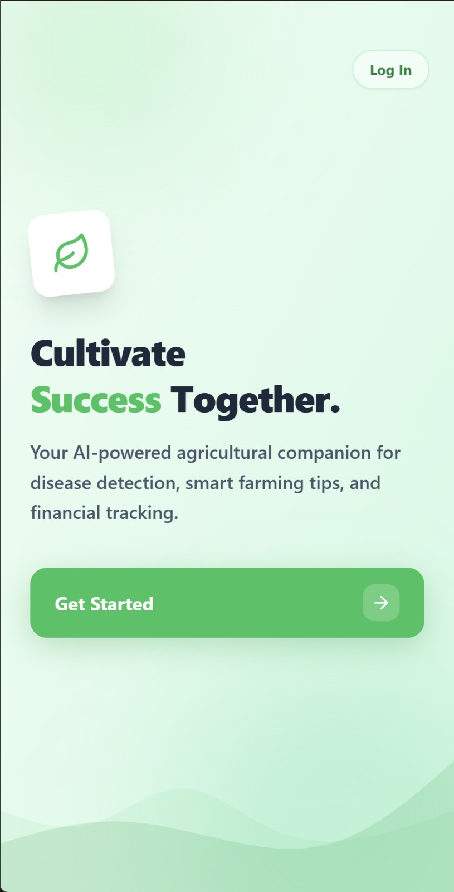
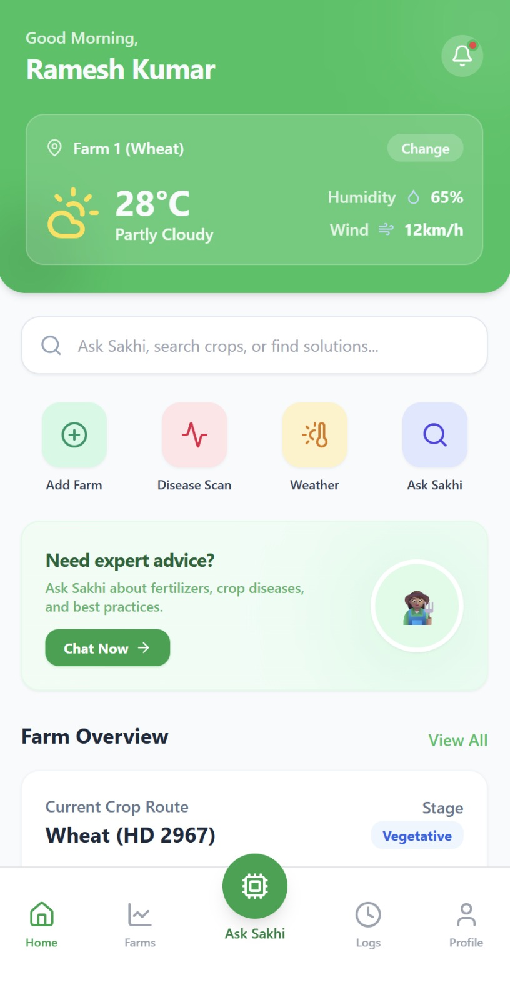
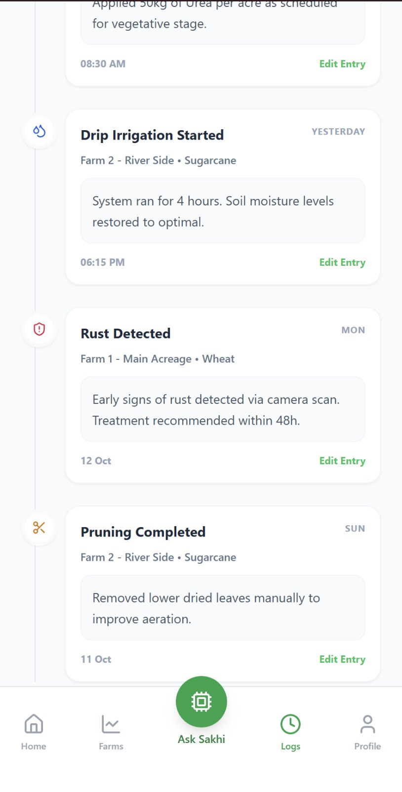

# 🌾 Krishi Sakhi — *Farmer's Friend*

> An AI-powered Agricultural Decision Support Platform for smallholder farmers in India.

<p align="center">
  
  
  
</p>

---

## The Problem

India's agricultural extension worker-to-farmer ratio has fallen below **1 : 5,000**. Smallholder farmers make high-stakes decisions on crop selection, pest management, irrigation, and market timing **without any structured expert guidance**. Public extension services require travel and time most farmers simply cannot afford.

**Krishi Sakhi** fills that gap — a single AI-assisted interface, operable on low-end smartphones under intermittent connectivity.

---

## What It Does

| Capability | How |
|---|---|
| 🗣️ Conversational advisory | Ask questions in text or voice; get grounded, RAG-backed answers via Dify + Qdrant |
| 🌱 Crop recommendations | Soil NPK + weather inputs → ranked crop list from a Random Forest model |
| 🪲 Pest / disease detection | Upload a photo → MobileNetV2 classifies likely crop disease |
| 📈 Price forecasting | Prophet time-series model gives 7–14 day directional mandi signals (UP/DOWN/STABLE) |
| 🌦️ Live weather context | Open-Meteo integrated into every advisory query automatically |
| 🔬 Soil classification | Capture soil image → YOLOv8n classifies soil type (clay/loam/sandy/red/black/alluvial) |
| 🤝 SakhiNet Cooperative | Join farmer groups, share resources, request help, and chat with peers |
| 👑 Admin Portal | D3.js interactive network graph, farmer directory, ticket resolution, KVK blogs |
| 🔒 Safety guardrails | Never gives pesticide dosages, financial guarantees, or medical advice |

---

## System Architecture

```
┌─────────────────────── Client (PWA) ───────────────────────┐
│  React + Vite · Offline-capable · Android-installable       │
│  Input: Text  |  Voice (MediaRecorder)  |  Image            │
└────────────────────────────┬───────────────────────────────┘
                             │ HTTPS
┌────────────────────────────▼───────────────────────────────┐
│              Backend  (FastAPI · Python)                     │
│  • Auth via Supabase JWT (Phone OTP)                        │
│  • Assembles farmer context block from DB + weather API     │
│  • STT via Groq whisper-large-v3-turbo (cloud)              │
│  • TTS via Google gTTS (Indian English)                     │
│  • Dispatches to ML microservices                           │
│  • POSTs context + query directly to Dify Chat API          │
│  • Writes full audit record to Supabase                     │
└──────┬────────────────────────────────┬────────────────────┘
       │                                │
┌──────▼──────┐                 ┌───────▼───────────────────┐
│  Supabase   │                 │  Dify (RAG Agent)          │
│  PostgreSQL │                 │  Qdrant Cloud vector DB    │
│  Auth / S3  │                 │  Groq Llama-3.1-8b-instant │
│  RLS on all │                 │  (text) + Gemini (vision)  │
│  tables     │                 └───────────────────────────┘
└─────────────┘
       │
┌──────▼────────────────────────────────────────────────────┐
│  ML Microservices  (each an independent FastAPI service)   │
│  ┌─────────────┐ ┌──────────────┐ ┌────────────────────┐  │
│  │ YOLOv8n     │ │ Random Forest│ │ Prophet Forecaster │  │
│  │ Soil        │ │ Crop Rec.    │ │ Mandi Prices       │  │
│  │ F1: 91.69%  │ │ F1: 89.94%  │ │ MAPE: 9.68%        │  │
│  └─────────────┘ └──────────────┘ └────────────────────┘  │
│  ┌──────────────────────────────────────────────────────┐ │
│  │ MobileNetV2 Plant Disease Classifier (38 classes)    │ │
│  └──────────────────────────────────────────────────────┘ │
└───────────────────────────────────────────────────────────┘
```

---

## ML Model Performance

| Model | Metric | Score |
|---|---|---|
| Soil Classification (YOLOv8n) | F1 | **91.69%** |
| Crop Recommendation (Random Forest) | F1 | **89.94%** |
| Season Detection | F1 | **87.37%** |
| Price Forecasting (Prophet) | MAPE | **9.68%** |
| RAG Faithfulness (Ragas) | vs. Non-RAG 6.9% | **94.5%** |
| RAG Answer Relevancy | | **89.3%** |
| Advisory Latency | P50 | **2.0 s** |
| Pipeline Success Rate | | **100% (96/96 traces)** |

---

## Tech Stack

| Layer | Technology |
|---|---|
| Frontend | React + Vite (PWA, Android-installable) |
| Backend API | FastAPI (Python) |
| Database | Supabase PostgreSQL (Cloud, `ap-south-1`) |
| Auth | Supabase Auth — Phone OTP |
| File Storage | Supabase S3 (soil-images, pest-images) |
| RAG Agent | Dify Community Edition (self-hosted) |
| Vector Search | Qdrant Cloud |
| Embeddings | Dify-managed embedding provider |
| LLM (primary) | Groq — `Llama-3.1-8b-instant` |
| LLM (vision) | OpenRouter — `google/gemini-2.5-flash-image-preview:free` |
| LLM (fallback) | Groq direct API call if Dify fails |
| Voice STT | Groq `whisper-large-v3-turbo` (cloud, English) |
| Voice TTS | Google gTTS (Indian English — `tld=co.in`) |
| Soil ML | YOLOv8n (Ultralytics) |
| Pest / Disease ML | Hugging Face MobileNetV2 image classifier |
| Crop ML | Random Forest (scikit-learn) |
| Price ML | Prophet (Meta) |
| Weather | Open-Meteo (free, no key) |
| Mandi Data | data.gov.in (open government) |
| Containers | Docker Compose |

---

## Quick Start

See [`SETUP.md`](./SETUP.md) for complete setup instructions.

### TL;DR

```bash
# 1. ML Services (4 separate terminals)
cd ml/soil_classifier   && pip install -r requirements.txt && uvicorn main:app --port 8001 --reload
cd ml/crop_recommender  && pip install -r requirements.txt && uvicorn main:app --port 8002 --reload
cd ml/price_forecaster  && pip install -r requirements.txt && uvicorn main:app --port 8003 --reload
cd ml/plant_disease_classifier && pip install -r requirements.txt && python download_model.py && uvicorn main:app --port 8004 --reload

# 2. Backend
cd backend && .\venv\Scripts\Activate.ps1 && uvicorn main:app --reload --host 0.0.0.0 --port 8000

# 3. Frontend
cd frontend && npm install && npm run dev
```

---

## Project Structure

```
/
├── frontend/          # React + Vite PWA
│   └── src/
│       ├── screens/   # All app screens (Dashboard, Chat, Farms, Camera, etc.)
│       ├── components/ # Shared UI components + modals
│       ├── contexts/  # ChatContext (session state)
│       ├── hooks/     # useAuth, useVoiceRecorder
│       └── lib/       # backendClient.js, supabaseClient.js
│
├── backend/           # FastAPI application
│   ├── routers/       # advisory, farms, crops, expenses, activity, ml_scans, ml_insights, auth, weather
│   ├── services/      # context_assembler, dify_client, stt_service, tts_service, weather_client, qdrant_client
│   └── config.py      # Pydantic settings (reads from .env)
│
├── ml/
│   ├── soil_classifier/          # YOLOv8n FastAPI service (port 8001)
│   ├── crop_recommender/         # Random Forest FastAPI service (port 8002)
│   ├── price_forecaster/         # Prophet FastAPI service (port 8003)
│   ├── plant_disease_classifier/ # Hugging Face MobileNetV2 service (port 8004)
│   └── transcriber/              # Legacy (STT now handled by backend via Groq)
│
├── dify/              # Dify chatflow exports
├── kb/                # 6 knowledge base markdown files (ingested into Dify Dataset)
├── supabase-gen-code/ # Authoritative SQL migrations (001–020)
├── docs/              # Architecture, schema, solution references
└── docker-compose.yml
```

---

## Current Implementation Status

| Component | State |
|---|---|
| Frontend (React+Vite) | ✅ Live — 18 screens, PWA-installable |
| Backend (FastAPI) | ✅ Active — 9 routers, context assembly, STT/TTS |
| Advisory Pipeline | ✅ Working — FastAPI → Dify → gTTS → response |
| STT | ✅ Groq `whisper-large-v3-turbo` with timeout |
| TTS | ✅ gTTS Indian English with timeout |
| ML Services | ✅ All 4 services rebuilt with trained models |
| Camera / Soil Scan | ✅ Real image capture → YOLOv8n classification |
| Crop Recommendation | ✅ Random Forest via ml_insights endpoint |
| Price Forecasting | ✅ Prophet with rule-based fallback |
| Plant Disease Detection | ✅ MobileNetV2 Hugging Face classifier |
| Dify RAG Chatflow | ✅ Chatflow with Knowledge Retrieval (Qdrant) |
| Weather Integration | ✅ Open-Meteo live weather in context assembly |
| SakhiNet Community | ✅ Cooperative groups, help requests, shared resources |
| Admin Portal | ✅ Network graph, ticket management, farmer directory |

---

## Safety Guardrails

The Dify agent **will never**:
- Provide specific pesticide dosages or chemical formulations
- Make financial predictions or guarantee market prices
- Provide medical advice (humans or animals)
- Answer queries outside the agricultural domain

All unsafe queries are deferred to the nearest **Krishi Vigyan Kendra (KVK)** and the deferral is logged.

---

## Data Privacy

- 🔇 **Voice audio is never stored** — Groq Whisper processes in memory and discards immediately
- 🔒 **All storage buckets** enforce farmer-scoped path RLS (`path LIKE auth.uid() || '%'`)
- 🚫 **Service role key** is only used for ML output table inserts and audit logging — never in user-facing code

---

## Environment Variables

See `backend/.env.example` and `frontend/.env.example` for full reference.

---

## Database Overview

20 ordered migrations create the full schema. Core tables:

- **`farmers`** — profile, language, location (RLS: own row only)
- **`farms`** — land parcels with soil/irrigation info
- **`crop_records`** — active/past crops per farm (one active per farm enforced)
- **`expense_logs`** — categorised farm expenses
- **`activity_logs`** — farm task timeline
- **`advisory_sessions` + `advisory_messages`** — full immutable audit trail of every AI interaction
- **`soil_scans` / `pest_scans`** — ML outputs + S3 image paths (permanent, used for retraining)
- **`crop_recommendation_requests` / `price_forecast_requests`** — ML query logs
- **`ref_crops` / `ref_locations` / `ref_knowledge_documents`** — read-only reference tables

> **RLS is enabled on every table.** Farmers can only access their own rows. ML output tables are service-role-insert-only.

---

*For schema detail, RLS rules, and architecture — see [`docs/solution.md`](./docs/solution.md), [`docs/schema.md`](./docs/schema.md), and [`docs/ARCHITECTURE.md`](./docs/ARCHITECTURE.md).*
