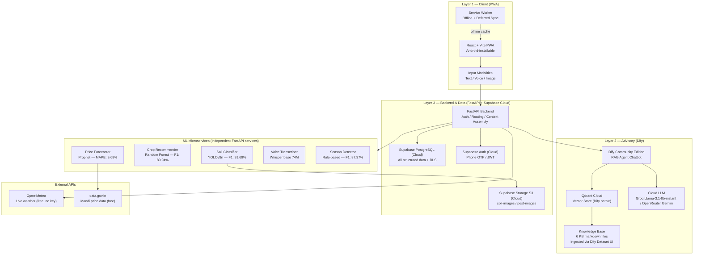
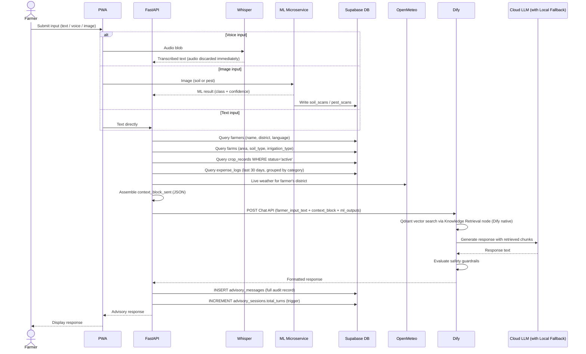
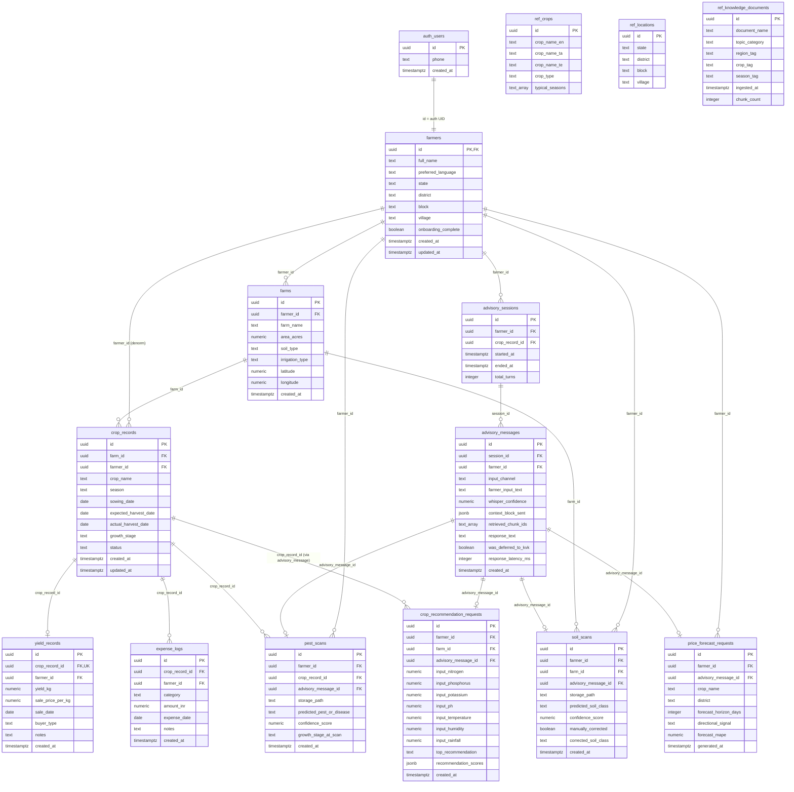
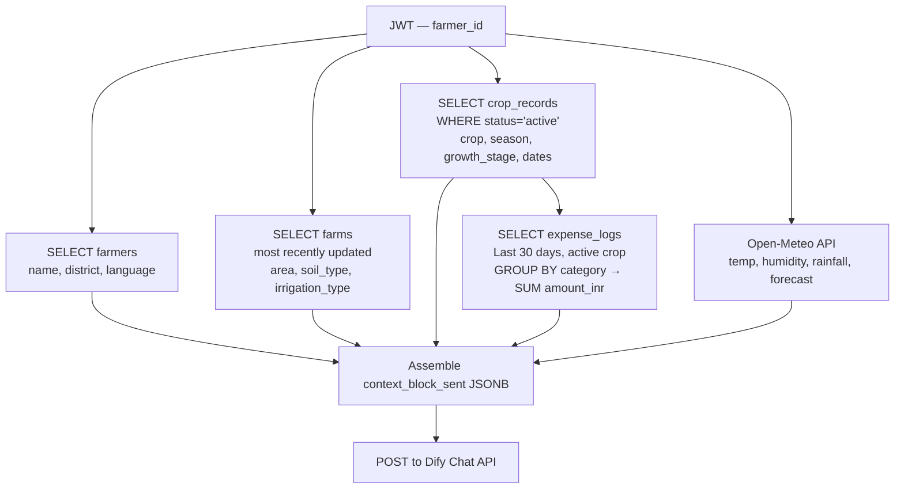
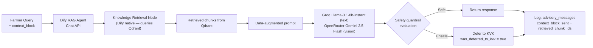
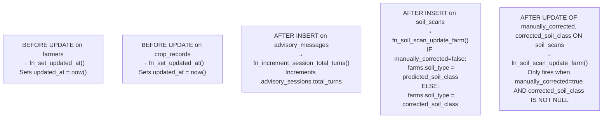
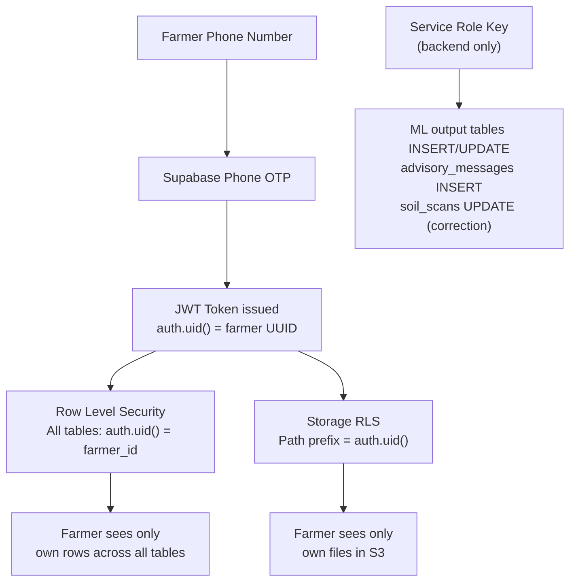

# Krishi Sakhi — Solution Reference Document

> Authoritative context document for AI agents, developers, and automated systems. Covers architecture, data flows, schema relationships, ML modules, RLS, and operational constraints. Read fully before writing code, migrations, or queries.

---

## 1. Project Identity

| Property | Value |
|---|---|
| Name | Krishi Sakhi ("Farmer's Friend") |
| Type | Agricultural Decision Support Platform |
| Target Users | Smallholder farmers — Tamil Nadu & Andhra Pradesh |
| Interface | Progressive Web App (PWA), mobile-first, Android-installable |
| Deployment | Hybrid (Supabase Cloud + Self-hosted Dify/ML) |
| Cloud Cost | Managed via Free Tiers (Supabase, Groq/OpenRouter) |
| Stage | Research prototype — not yet in field trial |

**Problem:** India's extension worker-to-farmer ratio has fallen below 1:5,000. Krishi Sakhi replaces fragmented, inaccessible advisory with a single grounded AI-assisted interface operable on low-end smartphones under intermittent connectivity.

---

## 2. System Architecture



---

## 3. Request Data Flow



---

## 4. Database Schema

### 4.1 Entity Relationship Diagram



### 4.2 Table Domain Summary

| Table | Domain | RLS INSERT | RLS DELETE | Notes |
|---|---|---|---|---|
| `farmers` | Profile | Own row | ❌ | id = auth.uid() |
| `farms` | Profile | Own row | Own row | Blocked if active crop_records exist |
| `crop_records` | Crop | Own row | ❌ | Partial unique index on (farm_id) WHERE status='active' |
| `yield_records` | Crop | Own row | ❌ | UNIQUE on crop_record_id |
| `expense_logs` | Expense | Own row | Own row | Correctable entries |
| `advisory_sessions` | Advisory | Own row | ❌ | |
| `advisory_messages` | Advisory | **Service role only** | ❌ | Immutable audit record |
| `soil_scans` | ML Output | **Service role only** | ❌ | Training data permanent |
| `pest_scans` | ML Output | **Service role only** | ❌ | |
| `crop_recommendation_requests` | ML Output | **Service role only** | ❌ | |
| `price_forecast_requests` | ML Output | **Service role only** | ❌ | |
| `ref_crops` | Reference | Service role only | Service role only | Static seed data |
| `ref_locations` | Reference | Service role only | Service role only | Static seed data |
| `ref_knowledge_documents` | Reference | Service role only | Service role only | Dify knowledge registry |

---

## 5. Migration Order


---

## 6. Context Assembly Query (Hot Path)

This runs on **every advisory request**. Must complete in a single pass. No recursive queries. No pagination. Target: P50 ≤ 2 seconds end-to-end.



**context_block_sent structure:**
```json
{
  "farmer": { "name": "", "district": "", "language": "" },
  "farm": { "name": "", "area_acres": 0, "soil_type": "", "irrigation_type": "" },
  "active_crop": { "name": "", "season": "", "growth_stage": "", "sowing_date": "" },
  "recent_expenses": { "seeds": 0, "fertilizer": 0, "pesticide": 0 },
  "weather": { "temp": 0, "humidity": 0, "rainfall": 0, "forecast": "" },
  "ml_outputs": {}
}
```

---

## 7. ML Microservices

```mermaid
graph TD
    subgraph SOIL_SVC["Soil Classifier"]
        S_IN["Input: soil surface image"]
        S_MODEL["YOLOv8n classification mode"]
        S_OUT["Output: class + confidence\nclay/loam/sandy/red/black/alluvial"]
        S_STORE["Store: soil-images S3 bucket\nWrite: soil_scans table\nUpdate: farms.soil_type via trigger"]
        S_IN --> S_MODEL --> S_OUT --> S_STORE
    end

    subgraph CROP_SVC["Crop Recommender"]
        C_IN["Input: N, P, K, pH, temp,\nhumidity, rainfall (7 features)"]
        C_MODEL["Random Forest — 22 crop classes"]
        C_OUT["Output: ranked crop list + confidence scores"]
        C_STORE["Write: crop_recommendation_requests"]
        C_IN --> C_MODEL --> C_OUT --> C_STORE
    end

    subgraph PRICE_SVC["Price Forecaster"]
        P_IN["Input: crop name + district\n+ historical mandi data"]
        P_MODEL["Prophet time-series model"]
        P_OUT["Output: UP/DOWN/STABLE\n+ MAPE (7 or 14 day horizon)"]
        P_STORE["Write: price_forecast_requests"]
        P_IN --> P_MODEL --> P_OUT --> P_STORE
    end

    subgraph VOICE_SVC["Voice Transcriber & Synthesizer"]
        V_IN["Input: audio blob (MediaRecorder)"]
        V_STT["Groq whisper-large-v3-turbo (Cloud STT)"]
        V_TTS["Google gTTS — Indian English (tld=co.in)"]
        V_OUT["Output: transcribed text & Base64 audio"]
        V_DISCARD["Audio NEVER stored — discarded in memory"]
        V_IN --> V_STT --> V_OUT
        V_TTS --> V_OUT
        V_STT --> V_DISCARD
    end

    subgraph SEASON_SVC["Season Detector"]
        SE_IN["Input: current date + district"]
        SE_MODEL["Rule-based + lightweight classifier"]
        SE_OUT["Output: Kharif/Rabi/Zaid + confidence"]
        SE_IN --> SE_MODEL --> SE_OUT
    end
```



### ML Module Performance

| Module | Metric | Value |
|---|---|---|
| Soil Classification | F1 | 91.69% |
| Crop Recommendation | F1 | 89.94% |
| Season Detection | F1 | 87.37% |
| Price Forecasting | MAPE | 9.68% |
| Price Forecasting | Directional Accuracy ±5% | 76.78% |
| RAG Faithfulness (Ragas) | vs Non-RAG (6.9%) | 94.5% |
| RAG Answer Relevancy | | 89.3% |
| RAG Context Recall | | 65.0% |
| RAG Context Precision | | 61.2% |
| Advisory latency | P50 | 2.0 seconds |
| Pipeline success rate | | 100% (96/96 traces) |

---

## 8. RAG Advisory Pipeline



**Safety guardrails — never permit:**
- Specific pesticide dosages or chemical formulations
- Financial predictions or guaranteed market price forecasts
- Medical advice (farm animals or humans)
- Any query outside agricultural scope

All deferral events logged: `advisory_messages.was_deferred_to_kvk = true`

---

## 9. Storage Buckets

| Bucket | Path Convention | Retention | RLS |
|---|---|---|---|
| `soil-images` | `{farmer_id}/{farm_id}/{unix_ts}.jpg` | Permanent (training data) | Path must start with `auth.uid()` |
| `pest-images` | `{farmer_id}/{crop_record_id}/{unix_ts}.jpg` | Permanent | Path must start with `auth.uid()` |

**Voice audio is NEVER stored.** Whisper processes in memory and discards immediately.

---

## 10. Database Triggers



---

## 11. Auth & RLS Architecture



**RLS rules summary:**
- `auth.uid() = farmer_id` on all application tables
- `auth.uid() = id` on `farmers` table (PK = auth UID)
- Service role required for: advisory_messages INSERT, all ML output table INSERT/UPDATE
- DELETE disabled on: farmers, crop_records, yield_records, advisory_sessions, advisory_messages, soil_scans, pest_scans, crop_recommendation_requests, price_forecast_requests

---

## 12. Technology Stack

| Layer | Component | Technology |
|---|---|---|
| Frontend | PWA | React + Vite |
| Frontend | Voice capture | Browser MediaRecorder API (native) |
| Frontend | Offline | Service Worker |
| Backend | API | FastAPI (Python) |
| Backend | Auth | Supabase Auth (Cloud) — Phone OTP |
| Backend | Database | Supabase PostgreSQL (Cloud) |
| Backend | Storage | Supabase Storage / S3 (Cloud) |
| RAG | Agent | Dify Community Edition (self-hosted Chat API) |
| RAG | Vector search | Qdrant Cloud (Dify native VECTOR_STORE) |
| RAG | Embeddings | Dify-managed embedding provider |
| RAG | LLM (text) | Groq `Llama-3.1-8b-instant` |
| RAG | LLM (vision) | OpenRouter `google/gemini-2.5-flash-image-preview:free` |
| RAG | LLM (fallback) | Groq direct API call (if Dify fails) |
| ML | Voice STT | Groq `whisper-large-v3-turbo` (Cloud, English) |
| ML | Voice TTS | Google gTTS — Indian English (`tld=co.in`) |
| ML | Soil | YOLOv8n (Ultralytics, classification mode) |
| ML | Crops | Random Forest (scikit-learn) |
| ML | Prices | Prophet (Meta/Facebook) / rule-based directional |
| Infra | Containers | Docker Compose |
| External | Weather | Open-Meteo (free, no key) |
| External | Mandi prices | data.gov.in (free, open government) |

**Constraints & Strategy:**
- Utilize free tiers (Supabase Cloud, Groq, OpenRouter) — no local GPU or Ollama required.
- FAISS, Ollama, n8n, and nomic-embed-text are NOT in this stack — replaced by Qdrant + Groq + Dify native retrieval.

---

## 13. Key Indexes

| Table | Index | Purpose |
|---|---|---|
| `farmers` | `(district)` | Price forecast joins, RAG context |
| `farms` | `(farmer_id)` | Context assembly |
| `crop_records` | `(farmer_id)`, `(farm_id)`, `(status)` | Context assembly hot path |
| `crop_records` | `UNIQUE (farm_id) WHERE status='active'` | One active crop per farm |
| `expense_logs` | `(farmer_id)`, `(crop_record_id)`, `(expense_date)` | 30-day summary query |
| `advisory_messages` | `(farmer_id)`, `(session_id)`, `(created_at)` | History queries |
| `advisory_messages` | `(was_deferred_to_kvk) WHERE true` | Safety compliance reports |
| `soil_scans` | `(manually_corrected) WHERE true` | Retraining dataset extraction |
| `pest_scans` | `(predicted_pest_or_disease)` | Future outbreak detection |
| `price_forecast_requests` | `(crop_name, district)` | Model performance aggregation |
| `ref_locations` | `(state, district)`, `(district)` | Onboarding dropdowns |

---

## 14. Constraints Reference

### CHECK Constraints (Critical)

| Table.Column | Allowed Values |
|---|---|
| `farmers.preferred_language` | `english`, `tamil`, `telugu` |
| `farms.soil_type` | `clay`, `loam`, `sandy`, `red`, `black`, `alluvial` |
| `farms.irrigation_type` | `rainfed`, `canal`, `borewell`, `drip`, `other` |
| `crop_records.season` | `kharif`, `rabi`, `zaid` |
| `crop_records.growth_stage` | `germination`, `vegetative`, `flowering`, `maturity`, `post-harvest` |
| `crop_records.status` | `active`, `harvested`, `abandoned` |
| `expense_logs.category` | `seeds`, `fertilizer`, `pesticide`, `labour`, `irrigation`, `equipment`, `other` |
| `advisory_messages.input_channel` | `text`, `voice`, `image` |
| `advisory_messages.whisper_confidence` | `NULL` when `input_channel != 'voice'` |
| `soil_scans.predicted_soil_class` | `clay`, `loam`, `sandy`, `red`, `black`, `alluvial` |
| `soil_scans.corrected_soil_class` | Same as above; NOT NULL when `manually_corrected = true` |
| `pest_scans.growth_stage_at_scan` | `germination`, `vegetative`, `flowering`, `maturity` |
| `price_forecast_requests.directional_signal` | `UP`, `DOWN`, `STABLE` |
| `price_forecast_requests.forecast_horizon_days` | `7`, `14` |
| `advisory_sessions.ended_at` | `NULL OR >= started_at` |

---

## 15. Known Limitations

| Gap | Status | Improvement Path |
|---|---|---|
| Multilingual UI (Tamil/Telugu) | Planned | Schema supports it via `ref_crops` name columns + `farmers.preferred_language` |
| Context Recall 65% | Known | Semantic chunking (character → semantic splits); Top-K calibration |
| No field trial data | Planned | No real farmer cohort yet |
| Latency P99 = 560s | Evaluation artifact only | Ragas batch LLM judge calls; interactive latency unaffected |
| Soil dataset small | Active | Each farmer upload is a training sample; improves with adoption |
| Price MAPE 9.68% | Acceptable for directional | Never surface as exact price; directional signal only |

---

## 16. Agent Behavioural Rules

1. Utilize Cloud LLM APIs (e.g., Groq, OpenAI, Anthropic) as the primary intelligence engine, maintaining local self-hosted LLMs strictly as a highly-available fallback mechanism.
2. Never store voice audio anywhere — memory-only, transcribe-and-discard.
3. Never bypass RLS with service role key in application code — service role for migrations/admin only.
4. Always populate `advisory_messages.context_block_sent` and `retrieved_chunk_ids` on every turn.
5. Validate `farmer_id` against `auth.uid()` before any write operation.
6. Do not modify `ref_*` tables through application layer — migration-controlled only.
7. Knowledge base ingestion is done via the Dify Dataset UI — do NOT use n8n or custom Python ingestion scripts.
8. When safety guardrail is ambiguous — defer to KVK and log.
9. All new tables must include `farmer_id uuid FK → farmers.id` + RLS before production use.
10. Supabase Cloud is the source of truth for DB and Storage; context assembly still requires single-pass reads.

---

## 17. Directory Structure

```
/
├── frontend/              # React + Vite PWA
│   ├── src/
│   │   ├── screens/       # Onboarding, AskSakhi, FarmRecords, ExpenseLog
│   │   ├── components/    # Shared UI components
│   │   └── hooks/         # Supabase client, auth, voice recorder
│   └── public/            # PWA manifest, service worker
│
├── backend/               # FastAPI application
│   ├── routers/           # advisory, farms, crops, expenses, auth
│   ├── services/          # context_assembler, ml_dispatcher, weather
│   └── models/            # Pydantic schemas matching DB tables
│
├── ml/
│   ├── soil_classifier/   # YOLOv8n FastAPI service
│   ├── crop_recommender/  # Random Forest FastAPI service
│   ├── price_forecaster/  # Prophet FastAPI service
│   └── transcriber/       # Whisper FastAPI service
│
├── dify/                  # Dify config, chatflow exports, knowledge base ingestion scripts
├── supabase/
│   ├── migrations/        # 001–019 ordered SQL migrations
│   └── seed/              # ref_crops, ref_locations data
│
└── docker-compose.yml     # All services
```

---

*solution.md v1.0 — derived from context.md, schema.md, migration files, and research paper. Update before architectural changes.*